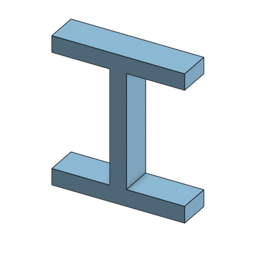
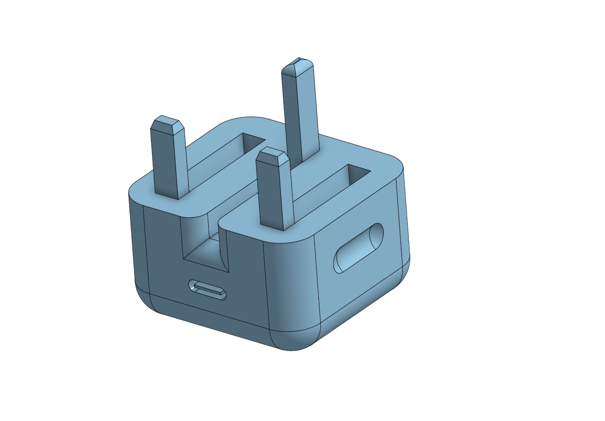
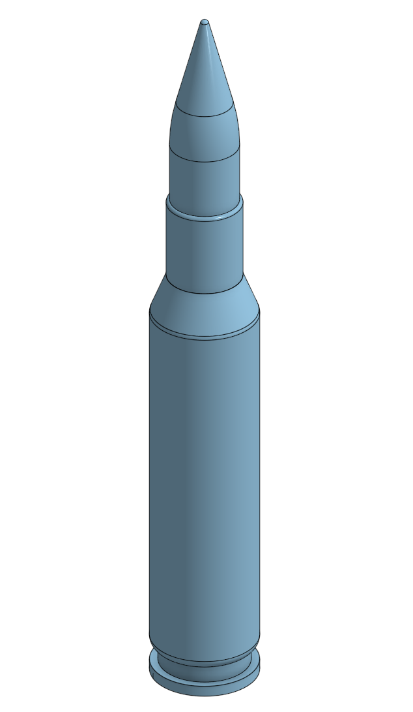

# All Machanical Projects
These are all the projects I worked on during my internship in the mechanical. They are divided into two sections: Modified Projects and cleared Projects.

## Modified Projects:
### 1- Four Gears ratio:
Change the number of teath

[Onshape link](https://cad.onshape.com/documents/4d53b952c61965283c5180c8/w/9f2374b4c07054edd8a0a331/e/3268f02be4df9bd8263ba02b?renderMode=0&uiState=69a64aeac0fafece81117743)

### 2- Shock Absorber:
Make the spring rotate with the gear.

[Onshape link](https://cad.onshape.com/documents/29898f60a6d5fa98c7035915/w/c027b0080ec57d55ffd3c461/e/b2e9fe28675e6842b37eea7b?renderMode=0&uiState=69a64b90c0fafece811178da)

### 3- Chassis:
Check if the Chassis is holding the motors and wheels well.

[Onshape link](https://cad.onshape.com/documents/34c707881706398cd16b87a3/w/393acf8edfed52a665db1550/e/d15ba09a15af12f08a5c99f0?renderMode=0&uiState=69a64cf016183fe7202d405b)

.png)

### 4- Robotic Arm:
Make gear relation in the end-effector.

[Onshape link](https://cad.onshape.com/documents/e3bd8ec72fd1965c7c460045/w/efc5c314086b705bb97cb7f0/e/3194d0fbfa50916d6639673b?renderMode=0&uiState=69a64e5988fb582d685f9f2b)

### 5- Servo Motor Holder:
Make the edges smooth and the base lower dipth.

[Onshape link](https://cad.onshape.com/documents/9973b01cf40bd34849565411/w/9dd61d5c9538b5675fb44449/e/008a8769edc2e9d71ec76d2e?renderMode=0&uiState=69ab33e1bc8ce682d21cfaa1)

## Cleared Projects:
### 1- First Project:

[Onshape link](https://cad.onshape.com/documents/fce264c22b85a50fa20a1e88/w/7e633c9d3793b00cbda921c9/e/d68b8f8d57553818f7b63e69?renderMode=0&uiState=69ab358165cb2e517b57f7cf)

### 2- Iphone-Type-C-adapter:

[Onshape link](https://cad.onshape.com/documents/f7d1de059be58881fd6eb5c7/w/84852bff5bb0ce6b1253fdca/e/c1fcdfa3abcaef5b3b2e52a1?renderMode=0&uiState=69ab364bedb3ed439d27b4f2)

### 3- Rifle Bullet:

[Onshape link](https://cad.onshape.com/documents/4e3aea07a3edb2a88961dbfb/w/c3cca500e49f7056f9ea77da/e/60887ea31474a65b89185e0e?renderMode=0&uiState=69ab3670b4e6ea33d7a06b06)

